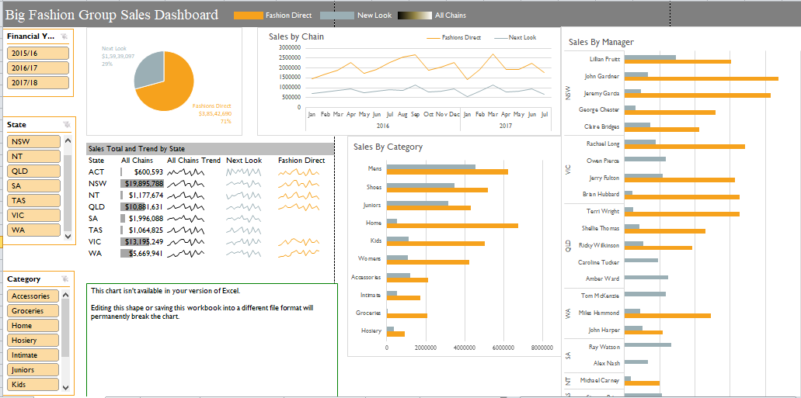

# Fashion-Sales-Analysis-With-Excel
Big Fashion Group Sales Dashboard Analysis with Excel
- 

## How to Use
To use these dashboards, download the Excel files and open them in Excel. The dashboards are designed to be user-friendly, with clear labels and interactive elements that allow users to explore the data in different ways.

## Customization
These dashboards are meant to be templates that can be customized to suit your specific needs. You can modify the data sources, add or remove charts and tables, and adjust the formatting to match your branding or preferences.

## Feedback and Contributions
I welcome feedback on these dashboards, as well as contributions from other Excel users who have created their own dashboards. Feel free to open an issue or pull request if you have suggestions or improvements to share.

Thank you for checking out my Excel dashboard repository

